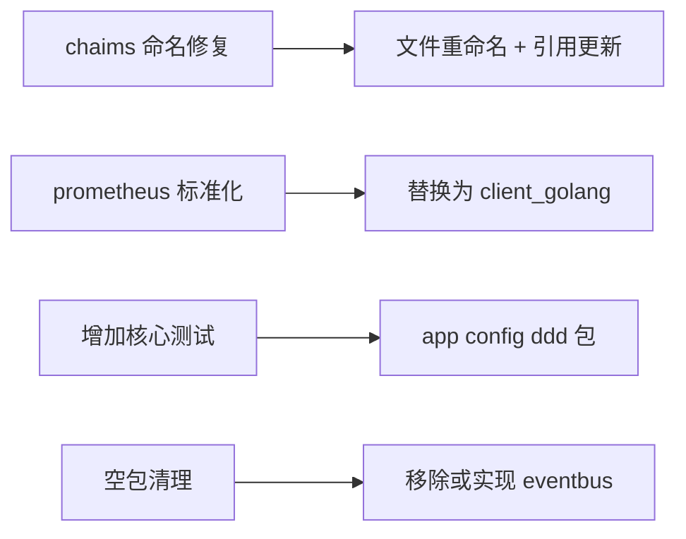
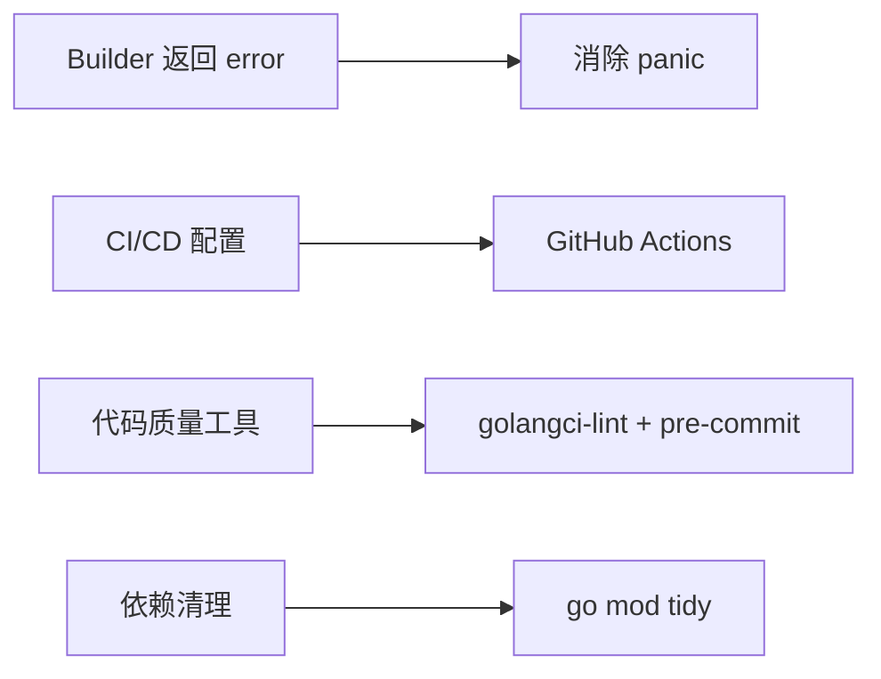
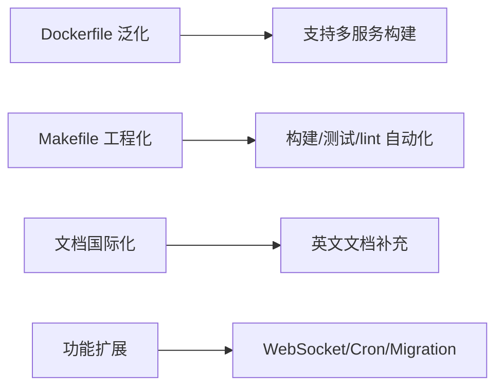

# go-workit 项目分析报告

> 项目定位：现代化的 Go Web 应用开发框架，基于 Gin (fork) + Fx DI + Viper + Zap 等技术栈。

---

## 新增发现的不足（第二轮分析）

### 7.1 拼写与命名问题

| 位置 | 问题 | 说明 |
|------|------|------|
| [`examples/quckstart/`](examples/quckstart/) | 目录名拼写错误 | "quckstart" → "quickstart"（缺少 i）|
| [`pkg/db/common.go:8`](pkg/db/common.go:8) | 常量 `MySQLDefaultDns` | DNS → **DSN**（Data Source Name）|
| [`pkg/db/common.go:9`](pkg/db/common.go:9) | `PostgresDefaultDns` | 同上 |
| [`pkg/db/common.go:10`](pkg/db/common.go:10) | `SQLServerDefaultDsn` | 同上（且大小写不一致）|
| [`pkg/db/pool.go:27`](pkg/db/pool.go:27) | 日志 `sucess` | → "success" |
| [`pkg/db/mysqlx/mysql.go:17`](pkg/db/mysqlx/mysql.go:17) | 函数名 `NewClinet` | → `NewClient`（缺少 i）|

### 7.2 组件生命周期管理缺失

| 组件 | 问题 |
|------|------|
| [`pkg/components/mongox/mongo.go`](pkg/components/mongox/mongo.go) | `NewClient` 未注册 OnStop 钩子关闭连接，可能导致连接泄漏 |
| [`pkg/components/kafkax/kafka.go`](pkg/components/kafkax/kafka.go) | `NewReader`/`NewWriter` 未注册 OnStop 钩子关闭资源 |
| [`pkg/components/miniox/minio.go`](pkg/components/miniox/minio.go) | 需检查是否有关闭逻辑 |
| [`pkg/components/elasticx/elasticx.go`](pkg/components/elasticx/elasticx.go) | 需检查生命周期管理 |

### 7.3 代码实现质量

| 位置 | 问题 |
|------|------|
| [`pkg/tools/validate/validate.go`](pkg/tools/validate/validate.go) | 每次调用 `IsEmail`/`IsPhone`/`IsIDCard` 都用 `regexp.MustCompile` 编译正则，应改为包级 `var` + `sync.Once` |
| [`pkg/tools/convert/convert.go`](pkg/tools/convert/convert.go) | `ToString` 未处理 `float32`、`int32`、`int64`、`uint` 等常见类型 |
| [`pkg/tools/encrypt/encrypt.go`](pkg/tools/encrypt/encrypt.go) | MD5 已不安全，应标记为 deprecated 或移除 |
| [`pkg/db/mysqlx/mysql.go:25-29`](pkg/db/mysqlx/mysql.go:25-29) | `Ping()` 失败后 `panic`，应返回 error（Builder 中已统一用 panic？不一致）|
| [`pkg/webapp/ginx/sse/sse.go`](pkg/webapp/ginx/sse/sse.go) | `Close()` 是空方法，不释放任何资源 |
| [`pkg/webapp/web/chaims_type.go`](pkg/webapp/web/chaims_type.go) | 大量 WS-Federation claim 常量（50+ 个 .NET 平台的 URI），Go 框架中使用场景极少 |
| [`pkg/webapp/auth/scheme/jwt/jwt_bearer.go`](pkg/webapp/auth/scheme/jwt/jwt_bearer.go) | 硬编码 `RS256`/`HS256`，应通过配置指定 |
| [`pkg/tools/excel/excel.go:29`](pkg/tools/excel/excel.go:29) | `cell := excelize.Cell{Value: cell}` 变量名与导入包名冲突，且不必要的包装 |

### 7.4 示例问题

| 示例 | 问题 |
|------|------|
| [`examples/quckstart/main.go`](examples/quckstart/main.go) | 导入了 `swagger docs` 但未调用 `app.UseSwagger()` |
| [`examples/di/main.go`](examples/di/main.go) | Swagger 注解与 DI 示例无关 |
| [`examples/quickstart`](examples/quickstart) | 目录名拼写错误，无法通过 `go run ./examples/quickstart` 运行 |

### 7.5 框架 API 不完整

| 位置 | 问题 |
|------|------|
| [`pkg/app/application_builder.go:102`](pkg/app/application_builder.go:102) | `ConfigureOptions` 标记为"暂未实现"，文档注释中提到了但代码为空 |
| `pkg/webapp/reqdecp/` | 请求解压功能与 `pkg/webapp/ginx/req_decompression.go` 职责重叠 |

---

## 一、代码设计与质量问题

### 1.1 严重命名错误：`chaims` → `claims`

整个 [`pkg/webapp/web/`](pkg/webapp/web/) 包中将 "claims" 拼写为 "chaims"，包括文件名和类型名：

| 文件名 | 问题 |
|--------|------|
| [`chaims.go`](pkg/webapp/web/chaims.go) | 应为 `claims.go` |
| [`chaims_principal.go`](pkg/webapp/web/chaims_principal.go:8) | 类型 `ClaimsPrincipal` 正确，但文件名错误 |
| [`chaims_type.go`](pkg/webapp/web/chaims_type.go) | 应为 `claims_type.go` |
| [`chaims.go`](pkg/webapp/web/chaims.go) | 类型 `Claim` 正确，文件名错误 |

**影响**：影响代码可读性、API 导出命名一致性、搜索索引。

### 1.2 可观测性指标为手写 Prometheus 文本格式

[`pkg/webapp/observability/metrics.go:108`](pkg/webapp/observability/metrics.go:108) 中的 [`PrometheusText()`](pkg/webapp/observability/metrics.go:108) 方法通过字符串拼接手动构建 Prometheus exposition 格式，而非使用标准 `prometheus/client_golang` 库。

**问题**：
- 缺乏标准 Prometheus 指标注册、类型安全、自动聚合能力
- 手动标签转义容易出错（虽已实现 `escapeLabelValue` 但无全面测试覆盖）
- 无法与社区生态（Grafana 默认面板、告警规则）无缝集成
- 缺少 Summary 类型指标（仅支持 Histogram 近似）

### 1.3 拼写错误：`policys` → `policies`

[`pkg/webapp/authz/options.go:11`](pkg/webapp/authz/options.go:11) 中字段名为 `policys`（应为 `policies`）。

### 1.4 空包问题

| 包路径 | 内容 | 问题 |
|--------|------|------|
| [`pkg/eventbus/event.go`](pkg/eventbus/event.go) | 仅 `package eventbus` | 空文件，无实际功能 |
| [`pkg/eventbus/event_bus.go`](pkg/eventbus/event_bus.go) | 仅 `package eventbus` | 空文件，无实际功能 |
| [`pkg/host/host.go`](pkg/host/host.go) | 仅有 `Host` 接口 | 过于抽象，几乎无实际价值 |

实际的事件总线实现在 [`pkg/ddd/domain_eventbus.go`](pkg/ddd/domain_eventbus.go) 中，依赖 `go-mediatr` 库。`pkg/eventbus` 包的存在会造成困惑。

### 1.5 不一致的错误处理模式

框架中存在两种错误处理方式混用：

- **Panic** 式：
  - [`pkg/webapp/auth/options.go:27`](pkg/webapp/auth/options.go:27) - `panic("scheme already exists")`
  - [`pkg/webapp/web_application_builder.go:70`](pkg/webapp/web_application_builder.go:70) - `panic("default scheme is required")`
  - [`pkg/config/config_builder.go:143`](pkg/config/config_builder.go:143) - `panic(err)` 在配置合并失败时
  - [`pkg/webapp/ginx/web_application.go:65`](pkg/webapp/ginx/web_application.go:65) - `panic` 端口无效时

- **返回错误**：部分中间件通过 `c.AbortWithStatus` 返回错误

**建议**：Builder 模式应返回 `error`，避免在构建阶段 panic。

### 1.6 Context 值使用字符串 Key

多个中间件使用明文 string 作为 context key：
- [`pkg/webapp/ginx/authenticate.go:69`](pkg/webapp/ginx/authenticate.go:69) - `c.Set("claims", ...)`
- [`pkg/webapp/ginx/localization.go:36`](pkg/webapp/ginx/localization.go:36) - `c.Set("localizer", ...)`

这容易导致 key 冲突，应使用自定义类型作为 context key。

### 1.7 限流器无统一 Options 注册机制

其他模块（如 `auth`、`authz`）都有统一的 `Options` 结构体和注册方法，但 [`pkg/webapp/ratelimit/`](pkg/webapp/ratelimit/) 缺少对应的 `options.go` 文件来统一管理各限流策略的注册。

### 1.8 Forked Gin 依赖

[`go.mod:152`](go.mod:152) 中：
```
replace github.com/gin-gonic/gin => github.com/xiaohangshu-dev/gin v0.0.0-20251127022746-130901f68014
```

**问题**：
- 下游使用者必须在自己的 `go.mod` 中添加同样的 replace 指令（已在 README 说明）
- Fork 版本可能落后于上游 Gin 更新
- 供应链安全与维护负担

---

## 二、测试覆盖问题

### 2.1 测试数量严重不足

全项目仅 **7 个测试函数**（分布在 5 个测试文件中）：

| 文件 | 函数数 | 测试范围 |
|------|--------|----------|
| [`ginx/observability_test.go`](pkg/webapp/ginx/observability_test.go) | 3 | 指标中间件 + 健康检查映射 |
| [`ginx/authorize_test.go`](pkg/webapp/ginx/authorize_test.go) | 2 | 授权默认策略 |
| [`observability/health_test.go`](pkg/webapp/observability/health_test.go) | 2 | 健康检查聚合 |
| [`observability/metrics_test.go`](pkg/webapp/observability/metrics_test.go) | 2 | Prometheus 格式输出 |
| [`observability/options_test.go`](pkg/webapp/observability/options_test.go) | 2 | 默认配置 |
| [`observability/tracing_test.go`](pkg/webapp/observability/tracing_test.go) | 2 | Telemetry 初始化 |

**完全无测试的模块**：
- `pkg/app/` - 应用生命周期核心
- `pkg/config/` - 配置管理
- `pkg/db/` - 所有数据库实现（7 个包）
- `pkg/ddd/` - DDD 核心概念
- `pkg/webapp/` - Builder 构建流程
- `pkg/webapp/ginx/` 的大部分 - authenticate, ratelimit, recovery, logger, localization, req_decompression
- `pkg/webapp/auth/` - JWT 认证
- `pkg/webapp/ratelimit/` - 全部 4 种限流策略
- `pkg/worker/` - Worker 应用
- 全部 `pkg/tools/` 工具包（12 个包）
- 全部 `pkg/components/` 组件包（5 个包）

### 2.2 测试类型单一

- 无集成测试（Integration Test）
- 无端到端测试（E2E Test）
- 无基准测试（Benchmark）
- 无模糊测试（Fuzz Test）
- 无契约测试（Contract Test）

### 2.3 测试基础设施缺失

- 无 `testhelper` 或 `testutil` 包
- 无 Mock/Stub 实现
- 无测试 fixture 或 shared test data

---

## 三、文档问题

### 3.1 包文档覆盖不全

| 包 | 文档状态 |
|----|----------|
| [`pkg/webapp/doc.go`](pkg/webapp/doc.go) | ✅ 简要文档存在 |
| `pkg/ddd/` | ❌ 无包级别文档 |
| `pkg/db/` | ❌ 无包级别文档 |
| `pkg/eventbus/` | ❌ 文件为空 |
| `pkg/app/` | ❌ 无包级别文档 |
| `pkg/worker/` | ❌ 无包级别文档 |
| 所有 `pkg/tools/` 子包 | ❌ 无包级别文档 |

### 3.2 代码注释以中文为主

大部分注释为中文，如果项目目标是国际开源，需要中英双语或全英文注释。

### 3.3 README 与实际略有脱节

- README 展示的快速开始示例与当前 builder API 不完全一致（`webapp.NewBuilder()` vs `app.NewBuilder()`）
- 示例中使用 `MapRoute` 注册路由，但实际推荐方式已在演进

---

## 四、基础设施问题

### 4.1 无 CI/CD 配置

- ❌ 无 GitHub Actions / GitLab CI / Jenkins 配置
- ❌ 无自动化测试流水线
- ❌ 无自动化 lint/静态分析

### 4.2 无代码质量工具

- ❌ 无 `.golangci.yml` 配置文件
- ❌ 无 pre-commit hooks
- ❌ 无 `go vet` 强制检查
- ❌ 无依赖安全扫描

### 4.3 Dockerfile 可改进

[`build/docker/Dockerfile`](build/docker/Dockerfile)：
- 未锁定 `golang:alpine` 的具体版本号
- 仅针对 `cmd/service1` 构建，不具有通用性
- 无 `.dockerignore` 文件
- 构建参数硬编码

### 4.4 缺少工程化工具

- ❌ 无 Makefile 或 Taskfile
- ❌ 无版本号管理策略（version 包/标签）
- ❌ 无 CHANGELOG
- ❌ 无 lint 规则约束
- ❌ 无 git commit 规范（如 Conventional Commits）

---

## 五、架构设计问题

### 5.1 组件组织不一致

组件放在两个不同位置：
1. `pkg/components/` - elasticsearch, kafka, mongo, redis, minio
2. `pkg/db/gormx/` - GORM 相关（mysqlx, pgsqlx, sqlitex, sqlserverx）
3. `pkg/db/mysqlx/` - 非 GORM 的原始 SQL 驱动

同时，`pkg/webapp/` 下有对应的 `xxxctx/` 上下文包（redisctx, mongoctx 等），将组件初始化与 Web 应用绑定，限制了框架在非 Web 场景下的复用性。

### 5.2 空包/不足的包

```
pkg/eventbus/     → 空文件
pkg/host/         → 仅一个接口
```

### 5.3 功能缺失

作为现代 Web 框架，缺少以下能力：

| 功能 | 状态 |
|------|------|
| GraphQL 支持 | ❌ |
| WebSocket 支持（SSE 已存在） | ❌（仅 SSE） |
| 任务调度（Cron） | ❌ |
| 缓存抽象层 | ❌（仅为 Redis 封装） |
| 统一验证框架 | ❌（仅有基础 validate 工具） |
| 结构化错误处理 | ❌ |
| 功能开关（Feature Flag） | ❌ |
| 数据库迁移工具 | ❌ |
| OpenAPI 自动生成（从代码） | ❌（仅有 swaggo UI） |
| 消息队列抽象 | ❌（仅为 Kafka 封装） |

---

## 六、依赖管理问题

### 6.1 过多间接依赖

`go.mod` 中包含大量间接依赖（约 100+ 行 indirect），部分可能未被实际使用：
- `github.com/bytedance/sonic` - 高性能 JSON
- `github.com/goccy/go-json` - 另一个 JSON 库
- `github.com/goccy/go-reflect` / `go-yaml`
- `github.com/klauspost/crc32` 
- `github.com/zeebo/xxh3`

可能需要执行 `go mod tidy` 清理。

### 6.2 依赖版本锁定问题

replace 指令将整个框架与 fork 版 Gin 绑定，限制了用户的选择。

---

## 七、改进优先级建议

### P0 - 必须修复（高影响）



### P1 - 建议改进（中影响）



### P2 - 可后续优化（低影响）


